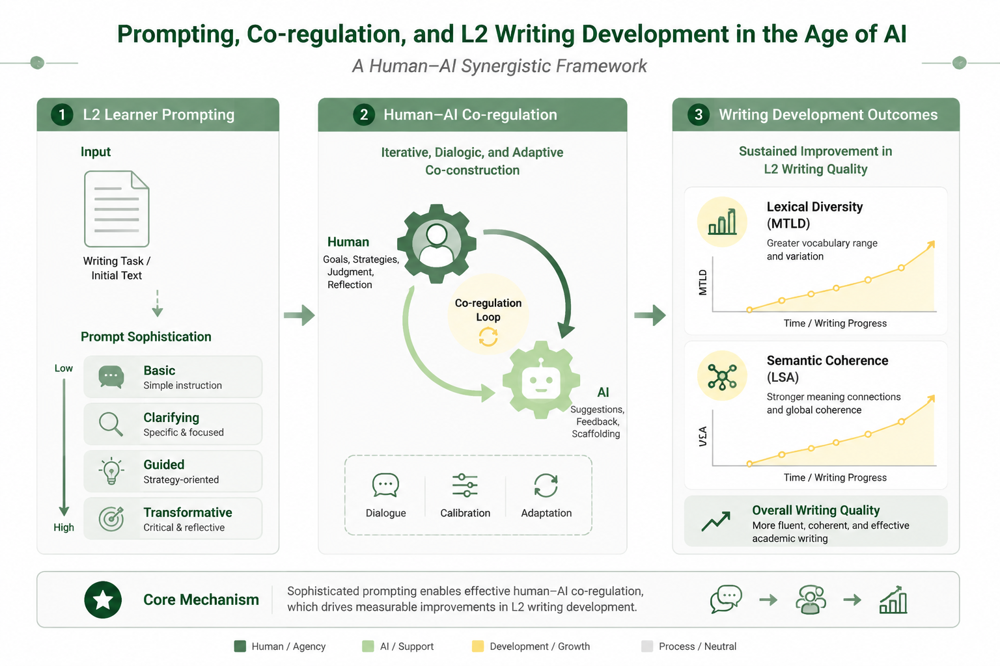
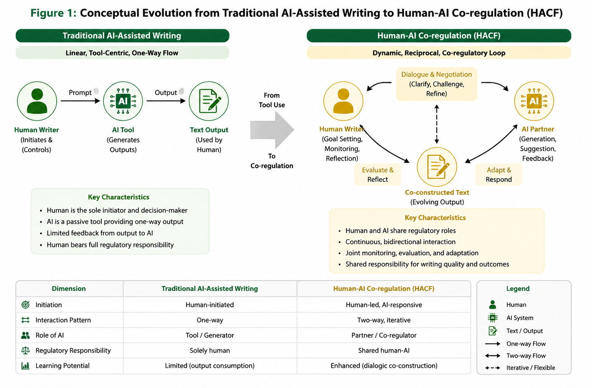
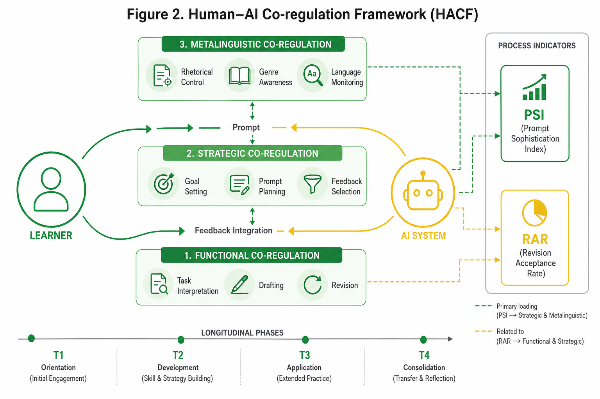
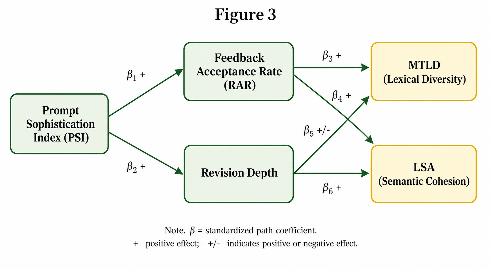
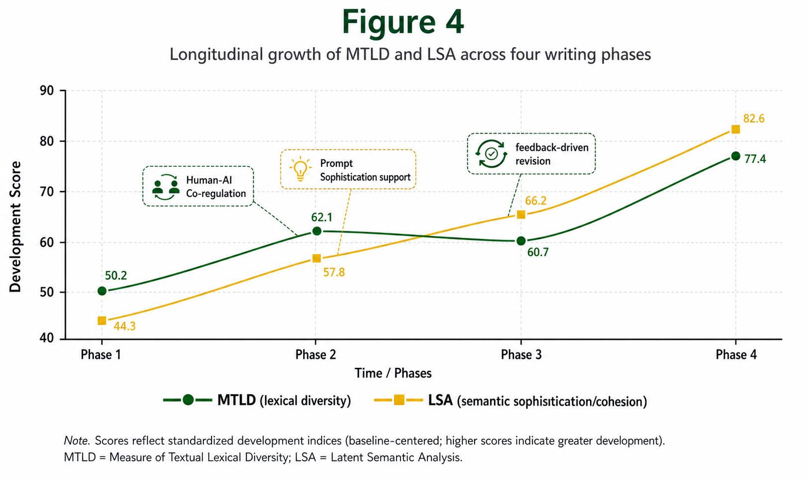
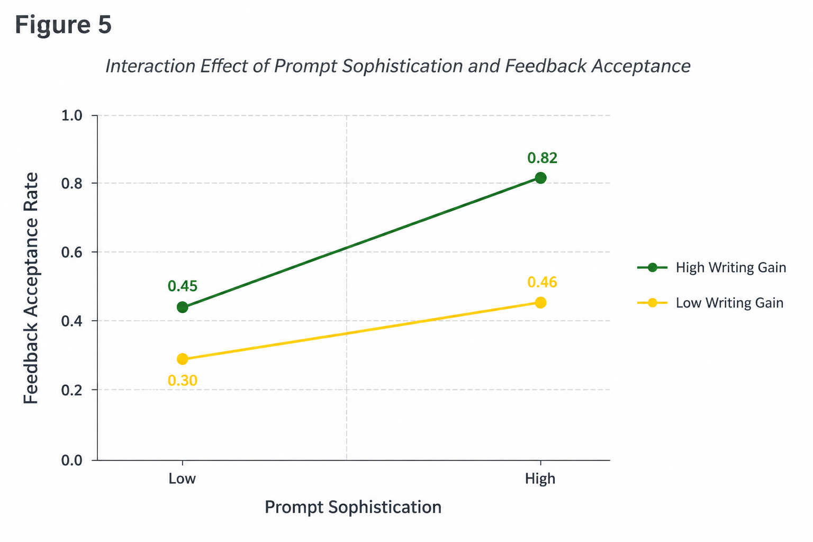
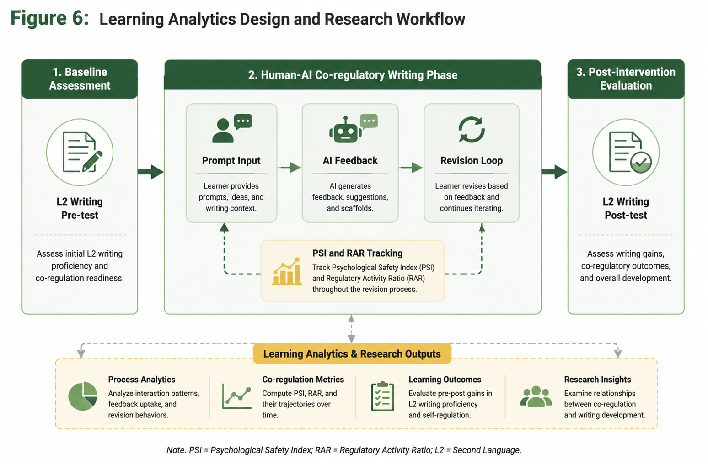
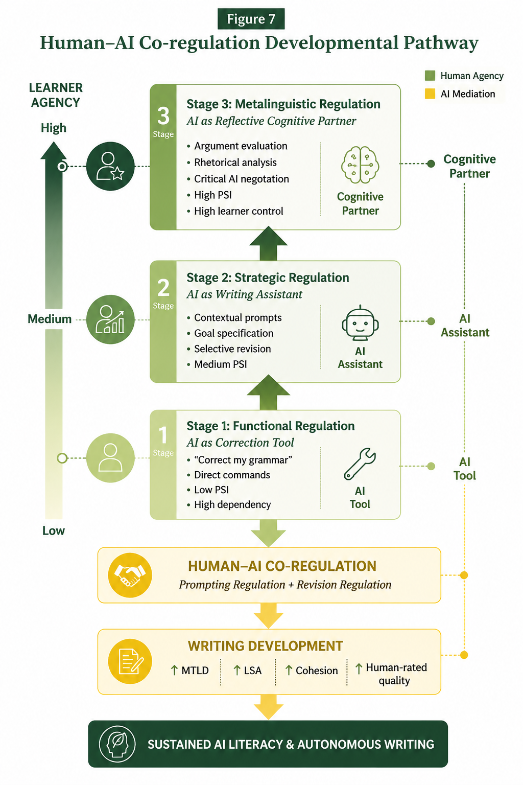

# Language Education in a Brave New World: Generative AI, Linguistic Identity, and the Authenticity Gap in AI-Assisted EFL Writing

This repository contains the supplementary materials, datasets, visual models, and analytical pipelines for the manuscript: **"Language Education in a Brave New World: Generative AI, Linguistic Identity, and the Authenticity Gap in AI-Assisted EFL Writing"** (Submission ID: `ETAL-D-26-00445`).

---

## 🎨 Visual Assets & Figures

### Graphical Abstract
<p align="center">
  
</p>

### Conceptual Models & Frameworks (HACF)
<p align="center">
  
</p>

<p align="center">
  
</p>

### Quantitative Findings & Mixed-Effects LMM Results
<p align="center">
  
</p>

<p align="center">
  
</p>

<p align="center">
  
</p>

### Qualitative Analysis & Linguistic Variations
<p align="center">
  
</p>

<p align="center">
  
</p>

---

## 📄 Abstract
Generative Artificial Intelligence (GenAI) has fundamentally disrupted Second Language (L2) writing practices. While AI-based revision tools drastically enhance formal linguistic quality, they simultaneously introduce an **Authenticity Gap**—a misalignment between the learners' true developmental proficiency and the polished output produced by the AI. This study proposes the **Hybrid Authenticity Control Framework (HACF)** to evaluate L2 writing in GenAI-assisted environments. Using a mixed-methods design, we track the evolution of L2 writers' identity, agency, and linguistic footprint (measured via $z_{LSA}$ and $z_{MTLD}$ indices) before and after AI mediation.

### Keywords
* Generative AI (GenAI)
* EFL Writing
* Linguistic Identity
* Authenticity Gap
* Hybrid Authenticity Control Framework (HACF)
* Mixed-Effects Models (LMM)

---

## 📁 Repository Structure
```text
.
├── figures/
│   ├── ga.png          # Graphical Abstract
│   ├── 1.png           # Figure 1: Conceptual Framework
│   ├── 2.png           # Figure 2: Methodology Pipeline
│   ├── 3.png           # Figure 3: Quantitative Metric Distribution
│   ├── 4.png           # Figure 4: LMM Regression Diagnostics
│   ├── 5.png           # Figure 5: Longitudinal Trajectories
│   ├── 6.png           # Figure 6: Qualitative Thematic Map
│   └── 7.png           # Figure 7: Post-hoc Contrasts / Linguistic Changes
├── scripts/            # R and Python data analysis pipelines (LMM, Praat, Coh-Metrix)
├── data/               # Anonymized qualitative transcripts & quantitative datasets
└── README.md           # Repository documentation (this file)
